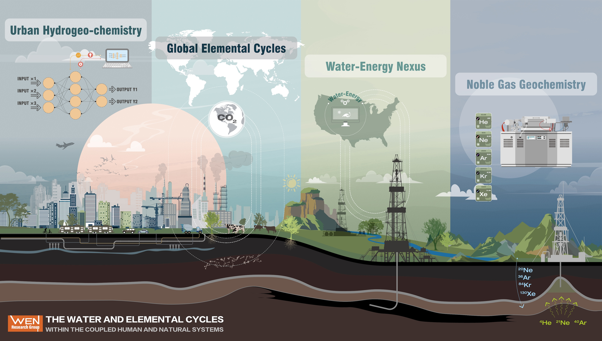

## Research Overview

The Wen Research Group studies how water, elements, and gases move through natural and human-altered landscapes. We combine field observations, laboratory geochemistry, environmental data science, and machine learning to investigate water quality, carbon and other elemental cycles, subsurface fluid transport, and Earth-surface processes. Our work is collaborative and community-facing: we build tools, datasets, and monitoring approaches that help students, partners, and the public better understand and respond to a changing environment.

Interested visitors, prospective group members, and collaborators can reach out to [Prof. Wen](/contact.qmd){target="_blank"} for details about current and upcoming projects.

::: {#fig-wen-group}
{fig-alt="Thematic illustration of research projects in the WEN Research Group"}

Thematic illustration of research projects in the WEN Research Group.
:::

::: {.figure-credit}
Illustrated by [MENG GRAPHICS LLC](https://xiaomengfu.myportfolio.com){target="_blank"}. Copyright © 2024 Tao Wen. All Rights Reserved.
:::

## Research Themes

::: {.theme-grid}
::: {.theme-card}
### Water Quality in Human-Impacted Systems

We investigate how energy development, urbanization, land use, and legacy infrastructure affect surface water and groundwater chemistry.
:::

::: {.theme-card}
### Noble Gases in Earth Systems

We use noble gases as tracers and dating tools for fluids, rocks, groundwater, and natural gas systems.
:::

::: {.theme-card}
### Global Water and Elemental Cycles

We assess water and elemental fluxes from terrestrial water systems using geochemical observations, hydrological modeling, Earth system perspectives, and data-driven methods.
:::

::: {.theme-card}
### Environmental Data Science

We develop data-driven methods for integrating large environmental datasets, geospatial information, and geochemical observations.
:::

::: {.theme-card}
### Open Science and Education

We build reusable data resources, teaching materials, and cyberinfrastructure to support transparent environmental research.
:::
:::

## Research Project Highlights

::: {#research-project-list}
:::

## Facilities

### Geochemical Instrumentation

WEN Group laboratory resources support water chemistry, stable isotope, and noble gas research. Major instruments include:

* Thermo Fisher Helix SFT and Argus VI mass spectrometers
* Perkin Elmer Avio 200 Inductively Coupled Plasma-Optical Emission Spectrometry (ICP-OES)
* Picarro L2130-i Water Isotope Analyzer with autosampler
* Milli-Q IQ 7005 Ultrapure Water System

The group also works with complementary facilities in the Department of Earth and Environmental Sciences, Syracuse University core laboratories, and neighboring SUNY ESF analytical resources.

### Research Computing Resources

The group uses dedicated workstations and Syracuse University research computing resources for geospatial analysis, machine learning, hydrologic modeling, and large environmental datasets. These resources support reproducible workflows from exploratory analysis through publication-ready data products.
